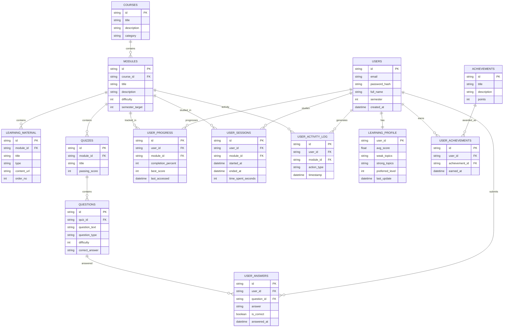

```mermaid
erDiagram

    USERS {
        string id PK
        string email
        string password_hash
        string full_name
        int semester
        datetime created_at
    }

    COURSES {
        string id PK
        string title
        string description
        string category
    }

    MODULES {
        string id PK
        string course_id FK
        string title
        string description
        int difficulty
        int semester_target
    }

    LEARNING_MATERIAL {
        string id PK
        string module_id FK
        string title
        string type
        string content_url
        int order_no
    }

    QUIZZES {
        string id PK
        string module_id FK
        string title
        int passing_score
    }

    QUESTIONS {
        string id PK
        string quiz_id FK
        string question_text
        string question_type
        int difficulty
        string correct_answer
    }

    USER_ANSWERS {
        string id PK
        string user_id FK
        string question_id FK
        string answer
        boolean is_correct
        datetime answered_at
    }

    USER_PROGRESS {
        string id PK
        string user_id FK
        string module_id FK
        int completion_percent
        int best_score
        datetime last_accessed
    }

    USER_SESSIONS {
        string id PK
        string user_id FK
        string module_id FK
        datetime started_at
        datetime ended_at
        int time_spent_seconds
    }

    USER_ACTIVITY_LOG {
        string id PK
        string user_id FK
        string module_id FK
        string action_type
        datetime timestamp
    }

    LEARNING_PROFILE {
        string user_id PK
        float avg_score
        string weak_topics
        string strong_topics
        int preferred_level
        datetime last_update
    }

    ACHIEVEMENTS {
        string id PK
        string title
        string description
        int points
    }

    USER_ACHIEVEMENTS {
        string id PK
        string user_id FK
        string achievement_id FK
        datetime earned_at
    }

    COURSES ||--o{ MODULES : contains

    MODULES ||--o{ LEARNING_MATERIAL : contains
    MODULES ||--o{ QUIZZES : contains
    MODULES ||--o{ USER_PROGRESS : tracked_in
    MODULES ||--o{ USER_SESSIONS : studied_in
    MODULES ||--o{ USER_ACTIVITY_LOG : activity

    QUIZZES ||--o{ QUESTIONS : contains

    QUESTIONS ||--o{ USER_ANSWERS : answered

    USERS ||--o{ USER_PROGRESS : progresses
    USERS ||--o{ USER_SESSIONS : studies
    USERS ||--o{ USER_ANSWERS : submits
    USERS ||--o{ USER_ACTIVITY_LOG : generates
    USERS ||--|| LEARNING_PROFILE : has
    USERS ||--o{ USER_ACHIEVEMENTS : earns

    ACHIEVEMENTS ||--o{ USER_ACHIEVEMENTS : awarded_as
```